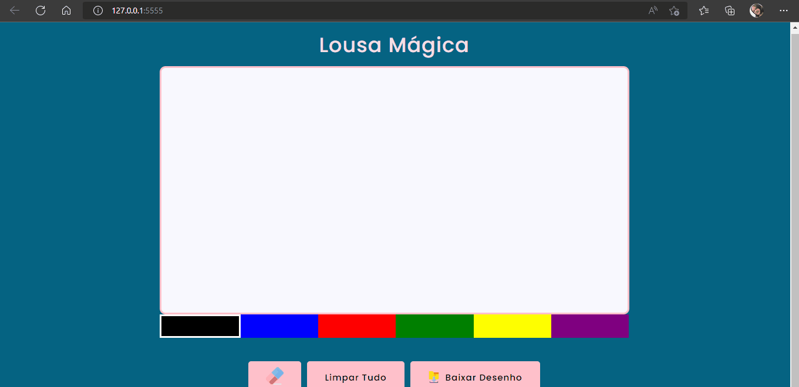

#### Desafio Lousa Mágica

#### Projeto Criar uma lousa mágica para diversão das crianças.

##### Na lousa tem a opção de desenhar, mudar as cores da caneta, apagar ou baixar o desenho.

[]

### Tecnologias utilizadas

 

  
  

   
   

[ ]
